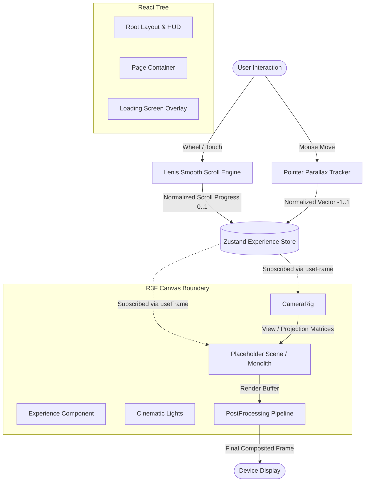

# System Architecture & Technical Specifications

This document outlines the core architecture of the cinematic 3D web experience, detailing the relationship between Next.js App Router, React Three Fiber (R3F), Zustand state management, Lenis smooth scrolling, and custom GLSL shader pipelines.

---

## 1. High-Level Architecture Overview

---

## 2. Decoupling React State from WebGL Render Loops

In high-performance 3D applications, standard React state updates (`useState`) inside the animation loop can cause rapid component re-rendering, garbage collection spikes, and dropped frames.

### Solution Implemented:
1. **Zustand Transient Access**: Inside `useFrame`, components read state directly (`store.getState()` or ref-backed values) without forcing React tree reconciliations at 60 FPS.
2. **Object Pooling**: Pre-allocated Three.js objects (`THREE.Vector3`, `THREE.Color`, `THREE.Euler`) are stored in persistent `useRef` hooks rather than instantiated on every frame.
3. **Exponential Damping (`damp`)**: Smooth interpolation uses frame-rate independent delta damping:
   $$\text{val}_{t} = \text{lerp}(\text{val}_{t-1}, \text{target}, 1 - e^{-\lambda \cdot \Delta t})$$
   This prevents animation speed discrepancies between 60Hz, 120Hz, and variable-refresh screens.

---

## 3. Camera Choreography System (`CameraRig.tsx`)

The camera coordinates are governed by a multi-tier interpolation formula:
- **Base Position**: Linearly or spline-interpolated across predefined scene milestones (`SCENES` array in `experienceStore.ts`).
- **Dynamic Look-At**: The camera look-at vector is continuously updated using dampened smoothing.
- **Pointer Parallax**: A subtle normalized mouse offset ($[-1, 1]$) adds natural depth and physical presence to the camera frustum without distorting perspective.
- **GSAP Interoperability**: The rig is decoupled such that GSAP timeline tweens can take authoritative control over camera position and FOV during scripted cinematic sequences.

---

## 4. Post-Processing Pipeline (`PostProcessing.tsx`)

Post-processing operates using `@react-three/postprocessing` built on `pmndrs/postprocessing`:
- **Bloom**: Selective thresholding ($0.25$) ensures that only bright specular highlights, glowing particle cores, and Fresnel crystal rims bloom into the scene.
- **Depth of Field (DoF)**: Simulates a physical camera aperture, softly blurring distant particles and foreground elements while maintaining razor focus on the primary subject.
- **Chromatic Aberration**: Mimics real-world optical dispersion near screen edges using radial modulation.
- **Vignette**: Focuses the viewer's gaze toward the center of the frame and conceals geometric boundaries.

---

## 5. Shader Organization (`src/three/shaders/`)

Shaders are modularized into typed TypeScript modules containing raw GLSL strings:
- Allows easy tree-shaking and zero runtime compilation overhead.
- Uniforms and attributes are strictly typed.
- Custom materials extend `THREE.ShaderMaterial` with dedicated update lifecycles.
